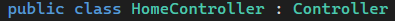
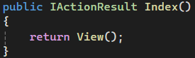
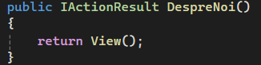
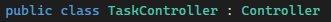
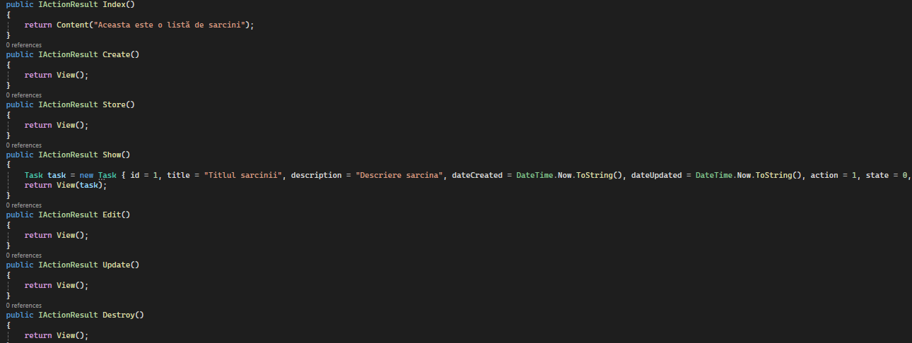
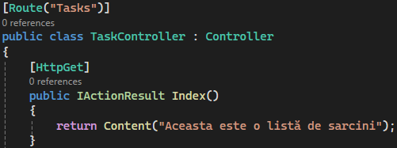
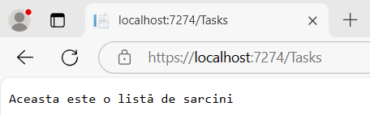

# Lucrare de laborator nr. 2. Cereri HTTP și șablonizare

## Sarcina Nr. 1. Pregătirea pentru lucru
    Pentru acest laborator am folosit frameworkul ASP.NET

## Sarcina Nr. 2. Principiile de bază ale lucrului cu cererile HTTP
1. Crearea rutelor pentru pagina principală și pagina
    1) Creați un controller HomeController pentru gestionarea cererilor către pagina principală.\
    
    2) Adăugați metoda index în HomeController, care va afișa pagina principală.\
    
    3) Creați ruta pentru pagina principală în fișierul routes/web.php. php public function index() { return view('home'); }
        - Deschideți browserul și accesați adresa http://localhost:8000. Asigurați-vă că pagina goală se încarcă, deoarece vizualizarea home.blade.php nu a fost încă creată.\
    
    În ASP.NET este automatizat procesul.
    
    4) În același controller HomeController, creați o metodă pentru pagina "Despre noi".\
    
    5) Adăugați ruta pentru pagina "Despre noi" în fișierul routes/web.php.\

    În ASP.NET este automatizat procesul de asemenea.

2. Crearea rutelor pentru sarcini

    1) Creați un controller TaskController pentru gestionarea cererilor legate de sarcini și adăugați următoarele metode:\
        \
        index — afișarea listei de sarcini;\
        create — afișarea formularului pentru crearea unei sarcini;\
        store — salvarea unei sarcini noi;\
        show — afișarea unei sarcini;\
        edit — afișarea formularului pentru editarea unei sarcini;\
        update — actualizarea sarcinii;\
        destroy — ștergerea sarcinii.\

        \

    2) Creați rutele pentru metodele controllerului TaskController în fișierul routes/web.php și specificați metodele HTTP corecte pentru fiecare rută.\
    \

    3) Utilizați gruparea rutelor pentru controllerul TaskController cu prefixul /tasks pentru a simplifica rutarea și a îmbunătăți lizibilitatea codului.
    \