# Lucrare de laborator nr. 2. Cereri HTTP și șablonizare

## Sarcina Nr. 1. Pregătirea pentru lucru
    Pentru acest laborator am folosit frameworkul ASP.NET

## Sarcina Nr. 3. Principiile de bază ale lucrului cu cererile HTTP
1. Crearea rutelor pentru pagina principală și pagina
    1) Creați un controller HomeController pentru gestionarea cererilor către pagina principală.\
    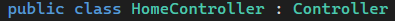
    2) Adăugați metoda index în HomeController, care va afișa pagina principală.\
    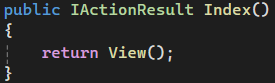
    3) Creați ruta pentru pagina principală în fișierul routes/web.php. php public function index() { return view('home'); }
        - Deschideți browserul și accesați adresa http://localhost:8000. Asigurați-vă că pagina goală se încarcă, deoarece vizualizarea home.blade.php nu a fost încă creată.\
    
    În ASP.NET este automatizat procesul.
    
    4) În același controller HomeController, creați o metodă pentru pagina "Despre noi".\
    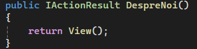
    5) Adăugați ruta pentru pagina "Despre noi" în fișierul routes/web.php.\

    În ASP.NET este automatizat procesul de asemenea.

2. Crearea rutelor pentru sarcini
    1) Creați un controller TaskController pentru gestionarea cererilor legate de sarcini și adăugați următoarele metode:\
        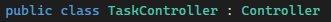\
        index — afișarea listei de sarcini;\
        create — afișarea formularului pentru crearea unei sarcini;\
        store — salvarea unei sarcini noi;\
        show — afișarea unei sarcini;\
        edit — afișarea formularului pentru editarea unei sarcini;\
        update — actualizarea sarcinii;\
        destroy — ștergerea sarcinii.\

        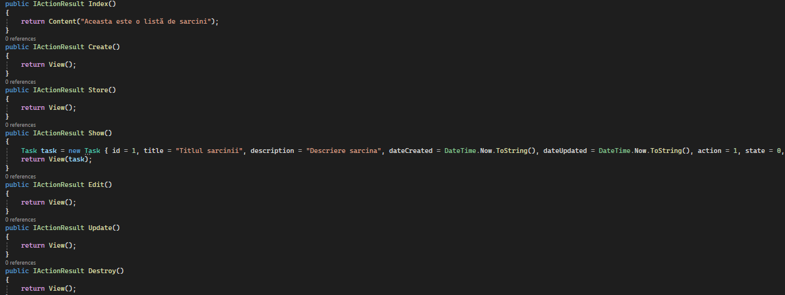\

    2) Creați rutele pentru metodele controllerului TaskController în fișierul routes/web.php și specificați metodele HTTP corecte pentru fiecare rută.\
    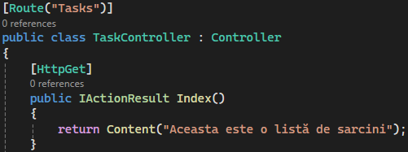\

    3) Utilizați gruparea rutelor pentru controllerul TaskController cu prefixul /tasks pentru a simplifica rutarea și a îmbunătăți lizibilitatea codului.\
    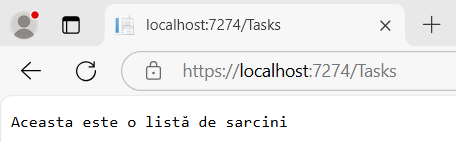\

    4) Definiți nume corecte pentru rutele controllerului TaskController, de exemplu:\
        - tasks.index — lista de sarcini;
        - tasks.show — afișarea unei sarcini individuale.\
        ...\
    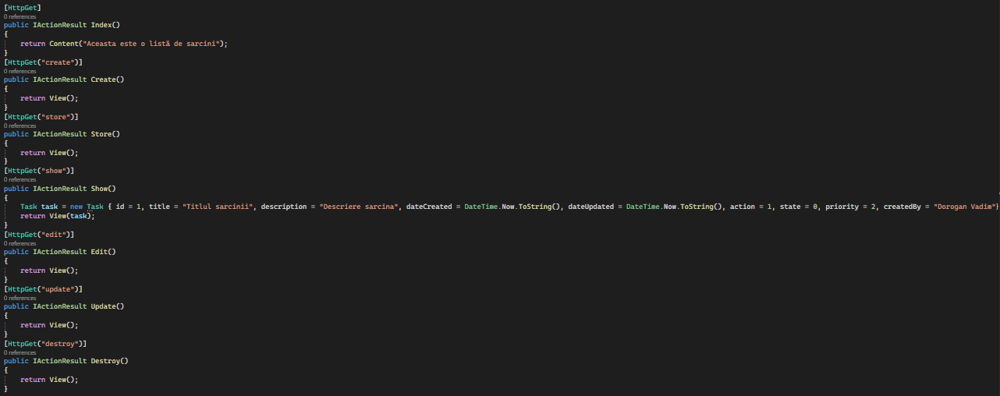\

    5) Adăugați validarea parametrilor rutei id pentru sarcini. Asigurați-vă că parametrul id este un număr întreg pozitiv. Utilizați metoda where pentru a limita valorile parametrului id.\
    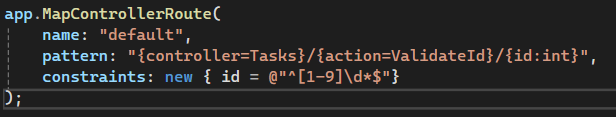\

## Sarcina Nr. 4. Șablonizarea folosind Blade
1. Crearea unui layout pentru pagini

    1. Creați un layout pentru paginile principale layouts/app.blade.php cu următoarele elemente comune ale paginii:
        1) Titlul paginii;
        2) Meniu de navigare;
        3) Conținutul paginii.\

    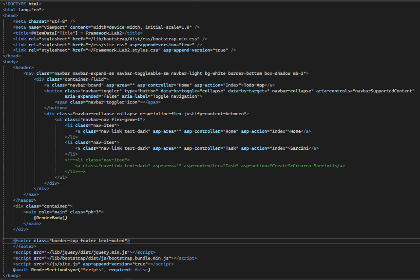\
    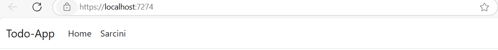\

2. Utilizarea șabloanelor Blade
    1. Creați vizualizarea pentru pagina principală home.blade.php folosind layoutul layouts/app.blade.php în directorul resources/views.
    2. Pe pagina principală trebuie să fie:
        1) Mesaj de bun venit: titlu și o scurtă descriere a aplicației, de exemplu „To-Do App pentru echipe”.
        2) Navigație: linkuri către secțiunile principale, cum ar fi:
            - Lista de sarcini;
            - Crearea unei sarcini.
        3) Informații despre aplicație: o scurtă descriere a scopului aplicației și a principalelor sale funcții.\
    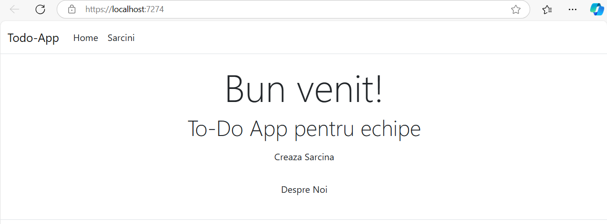\

    3. Creați vizualizarea pentru pagina "Despre noi" — about.blade.php folosind layoutul layouts/app.blade.php în directorul resources/views.\
    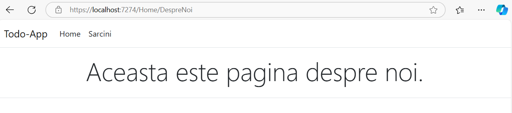\

    4. Creați vizualizări pentru sarcini cu următoarele șabloane în directorul resources/views/tasks:
        - index.blade.php — lista de sarcini;
        - show.blade.php — afișarea unei sarcini;\
        ...\
    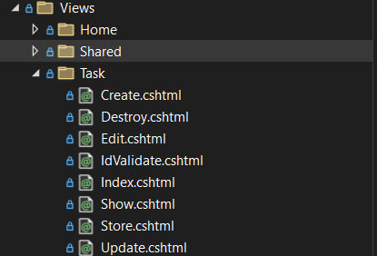\

    5. Randați lista de sarcini pe pagina index.blade.php folosind date statice transmise din controller cu ajutorul directivei @foreach.\
    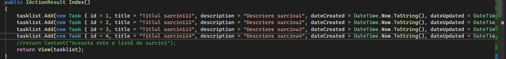\
    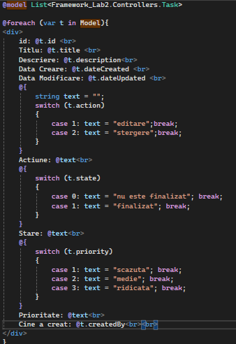\
    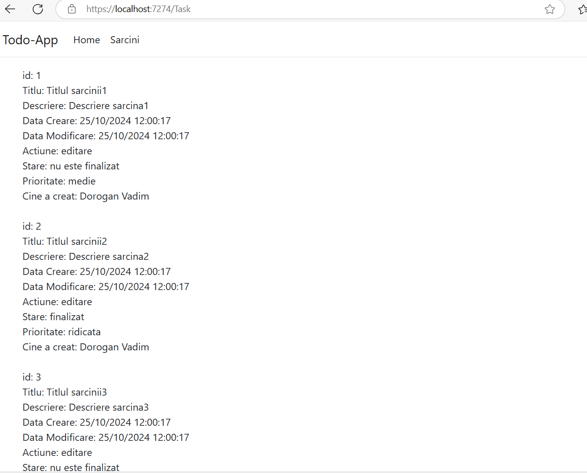\

3. Componente anonime Blade
    1. Creați o componentă anonimă pentru afișarea antetului (header). Folosiți componenta creată în layoutul layouts/app.blade.php.
    
    Realizarea este reprezentată în punctul 4.1
    
    2. Creați o componentă anonimă pentru afișarea sarcinilor:
        1) Componenta trebuie să fie simplă și să folosească parametri transmiși prin directiva @props. Acest lucru va face șabloanele mai flexibile și reutilizabile pe diverse pagini.
        2) Componenta trebuie să afișeze informații despre sarcină:
            - Titlul sarcinii;
            - Descrierea sarcinii;
            - Data creării sarcinii;    
            - Data actualizării sarcinii;
            - Acțiuni asupra sarcinii (editare, ștergere);
            - Starea sarcinii (finalizată/nu este finalizată);
            - Prioritatea sarcinii (scăzută/medie/ridicată);
            - Responsabilul sarcinii (Assignment), adică numele utilizatorului căruia i-a fost atribuită sarcina.
            - Afișați componenta de sarcină creată pe pagina show.blade.php folosind parametrii transmiși.\
    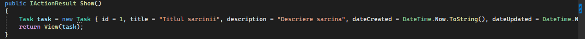\
    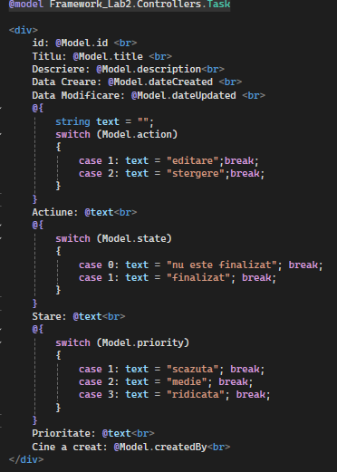\
    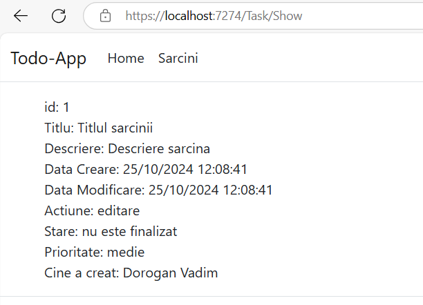\

4. Stilizarea paginilor
    1. Adăugați stiluri pentru pagini folosind CSS sau preprocesatoare (de exemplu, Sass sau Less).
    2. Creați un fișier de stiluri app.css în directorul public/css și includeți-l în layoutul layouts/app.blade.php.
    3. Adăugați stiluri pentru elementele paginii, cum ar fi titluri, meniuri de navigare, butoane, formulare etc.
    4. Opțional, puteți folosi biblioteci de stiluri, cum ar fi Bootstrap sau Tailwind CSS.\
    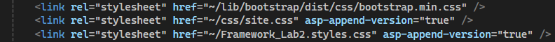\

